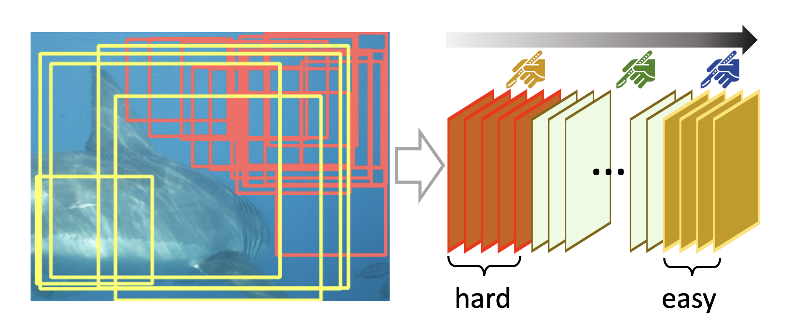
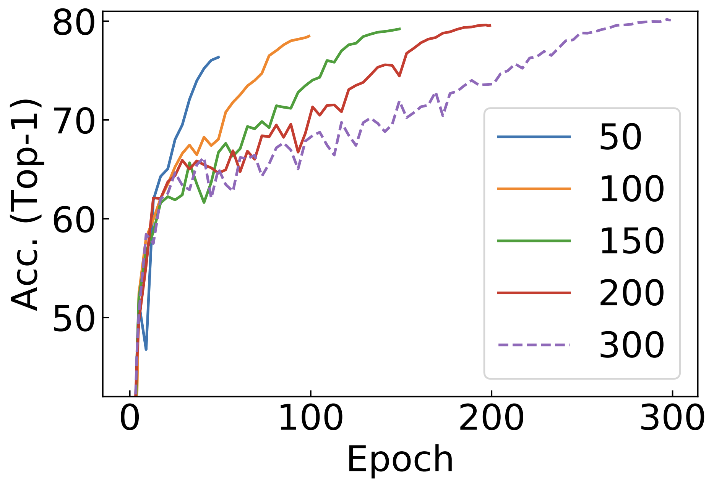

## 🚀🚀 FerKD: Surgical Label Adaptation for Efficient Distillation

[**FerKD: Surgical Label Adaptation for Efficient Distillation**](https://openaccess.thecvf.com/content/ICCV2023/papers/Shen_FerKD_Surgical_Label_Adaptation_for_Efficient_Distillation_ICCV_2023_paper.pdf), Zhiqiang Shen, ICCV 2023.

### Abstract

**🚀🚀 FerKD (Faster Knowledge Distillation)** is a novel efficient knowledge distillation framework that incorporates *partial soft-hard label adaptation coupled with a region-calibration mechanism*. Our approach stems from the observation and intuition that standard data augmentations, such as RandomResizedCrop, tend to transform inputs into diverse conditions: easy positives, hard positives, or hard negatives. In traditional distillation frameworks, these transformed samples are utilized equally through their predictive probabilities derived from pretrained teacher models. However, merely relying on prediction values from a pretrained teacher neglects the reliability of these soft label predictions. To address this, we propose a new scheme that calibrates the less-confident regions to be the context using softened hard groundtruth labels. The proposed approach involves the processes of *hard regions mining* + *calibration*.

## Citation

	@inproceedings{shen2023ferkd,
	      title={FerKD: Surgical Label Adaptation for Efficient Distillation}, 
	      author={Zhiqiang Shen},
	      year={2023},
	      booktitle={ICCV}
	}

## Soft Label Zoo

Please check the [soft labels](./soft_label_zoo) generated from different giant teacher models.

## Fast Convergence of FerKD

## Training

FerKD follows [FKD](https://github.com/szq0214/FKD/tree/main/FKD) traininig code and procedure while using different preprocessed soft labels, please download the soft label for FerKD at [link](./soft_label_zoo).

## Trained Models

| Method |  Network  | accuracy (Top-1)  |weights   |
|:-------:|:--------:|:--------:|:--------:|
| `FerKD` | ResNet-50 |  81.2 | [Download](https://drive.google.com/file/d/1wrs2-v8Dg8ghaJBDEmYLuGnk4mRbJek_/view?usp=sharing)  |
| &nbsp; `FerKD*` | ResNet-50 | 81.4  | [Download](https://drive.google.com/file/d/1HW9scG0OlKVa64C-sNxhmmsB0ZPTruIp/view?usp=sharing)  |

## Contact

Zhiqiang Shen (zhiqiangshen0214 at gmail.com) 

