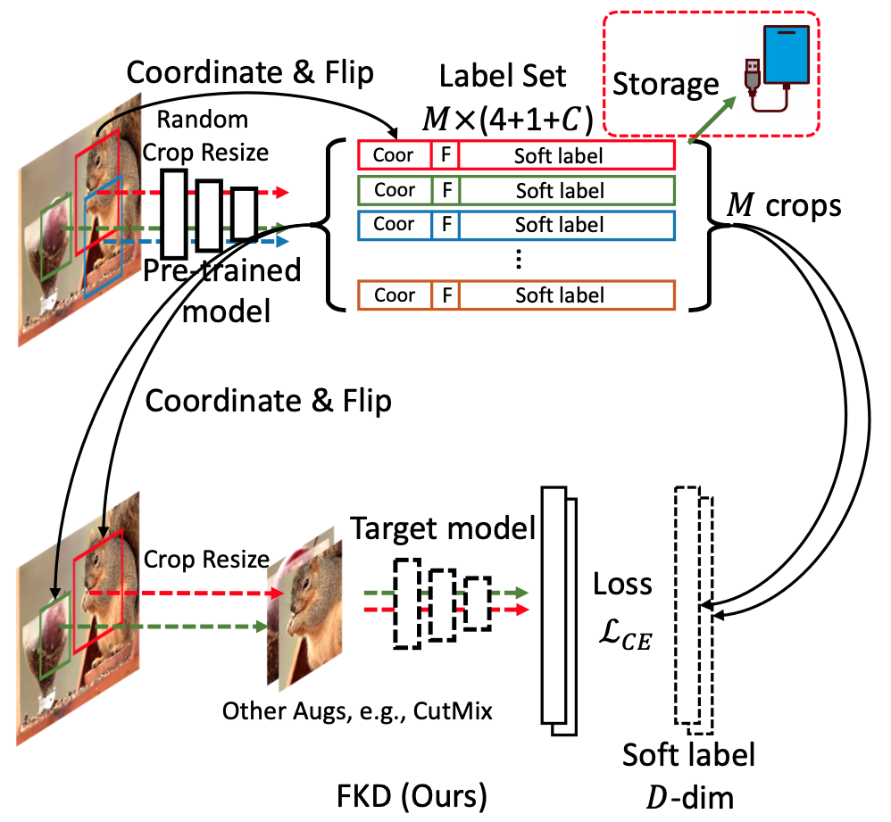

# Evolving Knowledge Distillation: The Role of Pre-generated Soft Labels

***This is a collection of our works targeted at utilizing pre-generated soft labels for stronger, faster and more efficient knowledge distillation.***

> [**FerKD**](./FerKD) (```@ICCV'23```): **FerKD: Surgical Label Adaptation for Efficient Distillation**

<div align=center>

</div>


> [**FKD**](./FKD) (```@ECCV'22```): **A Fast Knowledge Distillation Framework for Visual Recognition**

<div align=center>

</div>


## Bibtex
```bibtex
@inproceedings{shen2023ferkd,
  title={FerKD: Surgical Label Adaptation for Efficient Distillation},
  author={Zhiqiang Shen},
  booktitle={ICCV},
  year={2023}
}

@inproceedings{shen2021afast,
  title={A Fast Knowledge Distillation Framework for Visual Recognition},
  author={Zhiqiang Shen and Eric Xing},
  booktitle={ECCV},
  year={2022}
}
